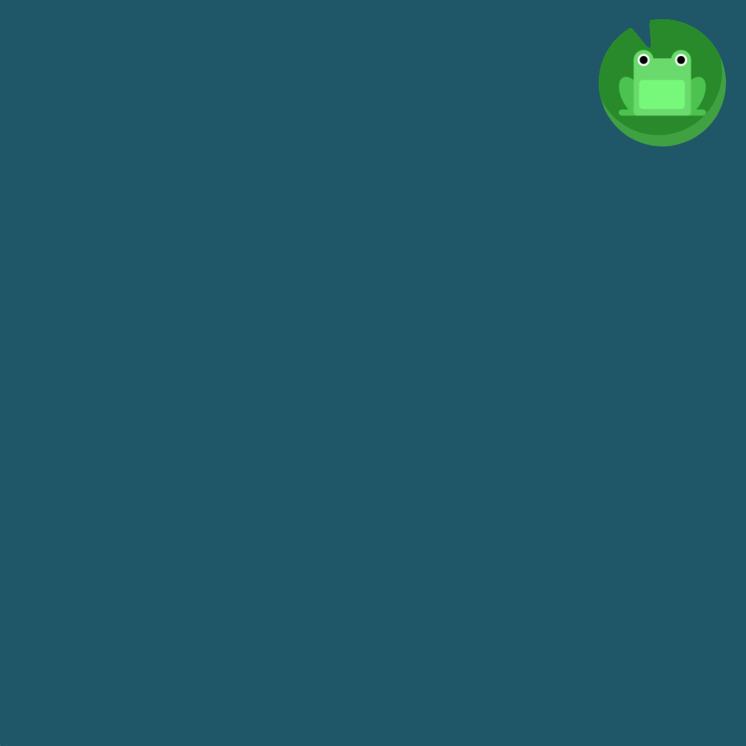

# FLEXBOX FROGGY LEVEL1

##### Flexbox Froggy에 오신 것을 환영합니다! Flexbox Froggy는 Froggy와 친구들 돕는 CSS 코드 게임입니다. 오른쪽의 `justify-content` 속성을 용하여 개구리가 수련잎으로 이동할 수 있도록 도와주세요. 이 속성은 다음의 값들을 인자로 받아 요소들을 가로선 상에서 정렬합니다:

- ##### `flex-start`: 요소들을 컨테이너의 왼쪽으로 정렬합니다.

- ##### `flex-end`: 요소들을 컨테이너의 오른쪽으로 정렬합니다.

- ##### `center`: 요소들을 컨테이너의 가운데로 정렬합니다.

- ##### `space-between`: 요소들 사이에 동일한 간격을 둡니다.

- ##### `space-around`: 요소들 주위에 동일한 간격을 둡니다.

##### 예를 들어, `justify-content: flex-end;`는 개구리를 오른쪽으로 이동시킵니다.

```css
#pond {
  display: flex;
  justify-content: flex-end;
}
```



해당 문제는 설명에서도 나온 것 처럼 justify-content : flex-end를 통해서 오른쪽으로 element를 정렬하여 해결할 수 있다.