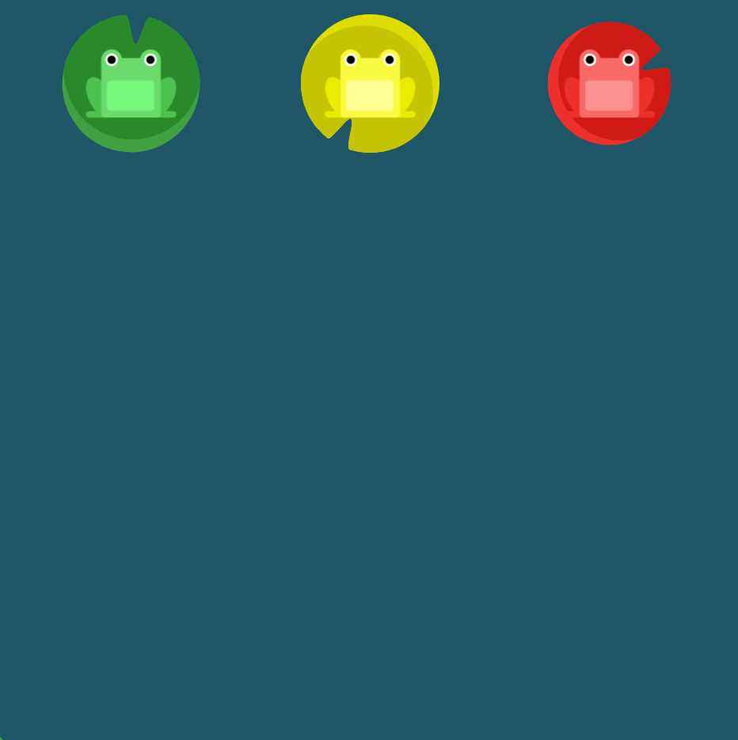

# FLEXBOX FROGGY LEVEL3

##### `justify-content`를 사용하여 세마리의 개구리가 모두 수련잎으로 이동할 수 있도록 도와주세요. 이번에는 수련잎 주위에 많은 간격이 있습니다.

##### 만약 이 속성에서 사용 가능한 인자들이 기억나지 않는다면, 포인터를 속성 이름 위로 이동시키세요. `justify-content` 위로 포인터를 이동시켜 보세.

```css
#pond {
  display: flex;
  justify-content : space-around;
}
```



해당 문제는 설명에서도 나온 것 처럼 space-around와 space-between이 헷갈렸는데 이 둘의 정의는 다음과 같다.

* space-between : 플렉스 요소는 요소들 사이에만 여유 공간을 두고 배치
* space-around : 플렉스 요소는 앞, 뒤, 그리고 요소들 사이에도 모두 여유 공간을 두고 배치