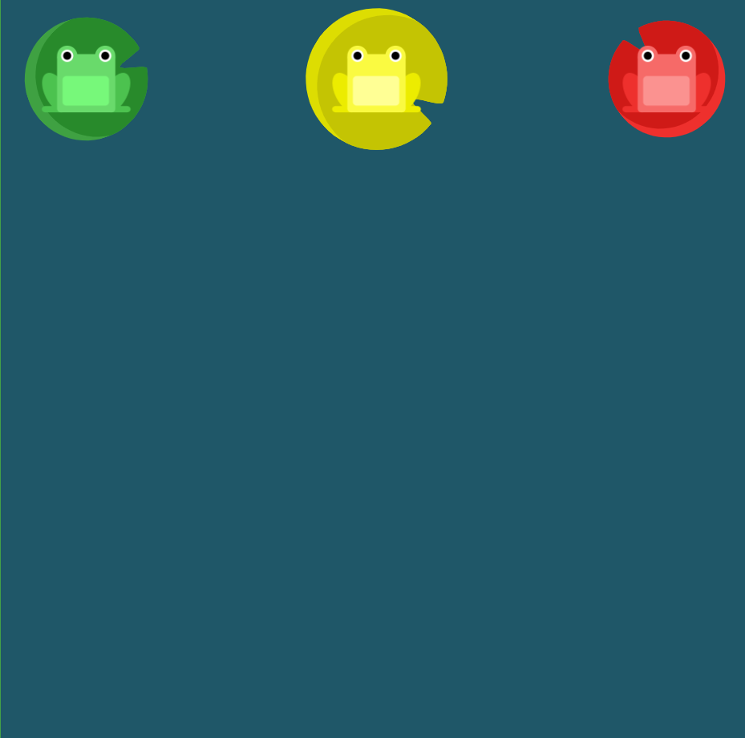

# FLEXBOX FROGGY LEVEL4

##### 수련잎이 연못가로 떠내려가면서 수련잎 사이의 간격이 넓어졌습니다. `justify-content`를 사용하세요. 이번에는 수련잎 사이에 동일한 간격이 있습니다.

```css
#pond {
  display: flex;
justify-content : space-between;
}
```



해당 문제는 설명에서도 나온 것 처럼 space-around와 space-between이 헷갈렸는데 이 둘의 정의는 다음과 같다.

* space-between : 플렉스 요소는 요소들 사이에만 여유 공간을 두고 배치
* space-around : 플렉스 요소는 앞, 뒤, 그리고 요소들 사이에도 모두 여유 공간을 두고 배치