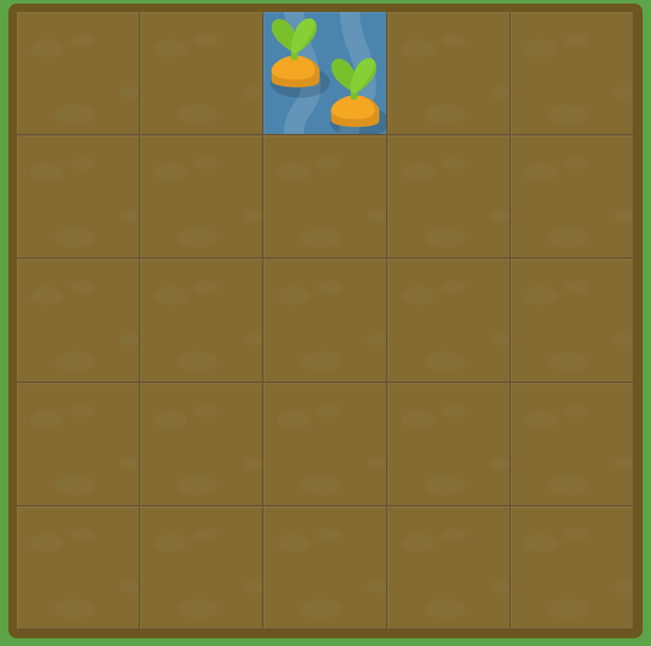

# GRID GARDEN LEVEL1

##### Grid 정원에 오신것을 환영합니다. 여러분들은 CSS 코드를 작성하여 여러분의 당근 정원을 키우실 수 있습니다. 당근이 있는 지역에 `grid-column-start` 속성을 이용하여 물을 주십시오.

##### 예를 들어, `grid-column-start: 3;`와 같이 입력시 그리드 세번째 세로선에서 시작되는 영역에 물을 불어 넣고 있습니다. 이는 그리드의 왼쪽에서 세번째 열(column) 항목을 뜻합니다.

```css
#garden {
	display: grid;
	grid-template-columns: 20% 20% 20% 20% 20%;
	grid-template-rows: 20% 20% 20% 20% 20%;
}

#water {
	grid-column-start : 3;
}
```



해당 문제는 설명에서도 나온 것 처럼 grid-column-start : 3; 이라는 속성을 부여하여서 물의 위치를 바꾸는 것으로 해결할 수 있다.