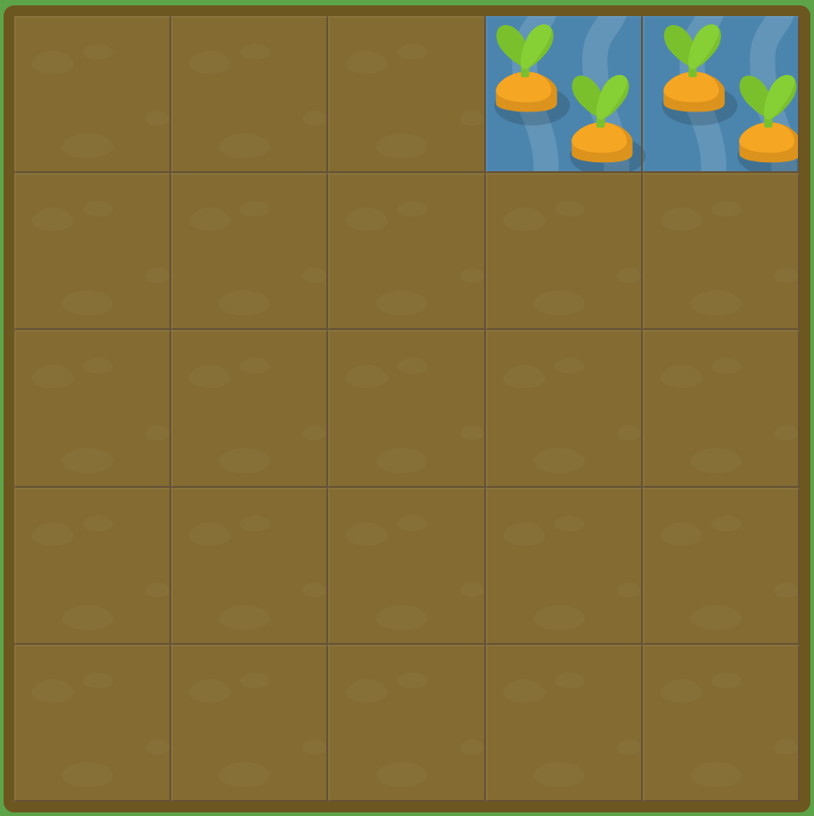

# GRID GARDEN LEVEL10

##### 매번 `grid-column-start`와 `grid-column-end`를 입력하는 것은 불편합니다. 다행스럽게, `grid-column`는 한번에 입력가능한 단축해서 설정으로, /(슬래쉬)로 구분됩니다.

##### 예를 들면, `grid-column: 2 / 4;`는 그리드 항목을 두번째 수직선에서 네번째 수직선까지로 설정합니다.

```css
#garden {
  display: grid;
  grid-template-columns: 20% 20% 20% 20% 20%;
  grid-template-rows: 20% 20% 20% 20% 20%;
}

#water {
  grid-column : 4 / 6;
}
```



grid-column-start와 grid-column-end로 따로 지정해주었던 값을 grid-column과 슬래쉬를 이용하여 한번에 적용하여 해결하였다.

