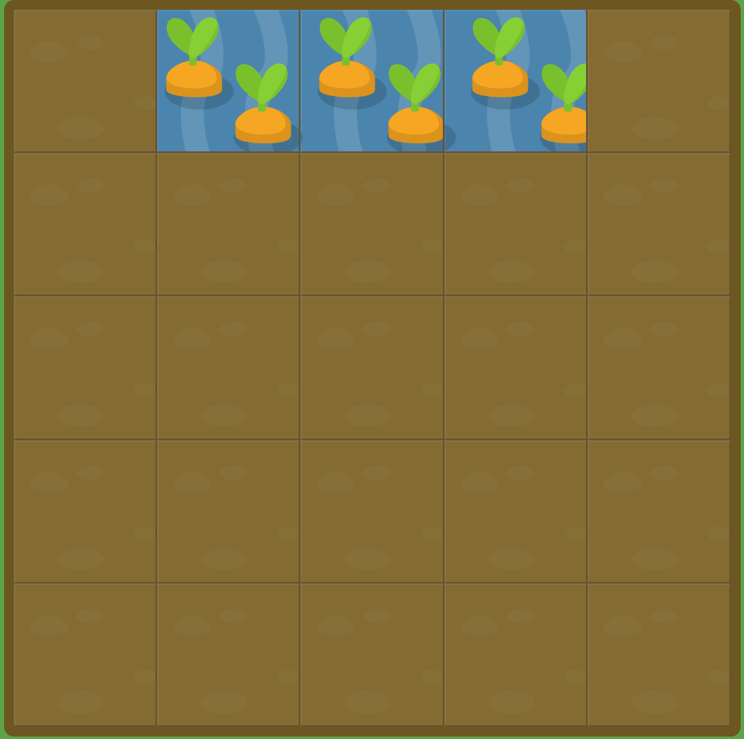

# GRID GARDEN LEVEL11

##### `grid-column`를 이용하여 당근에 물을 주십시오. `span` keyword도 그대로 사용이 가능합니다.

```
#garden {
  display: grid;
  grid-template-columns: 20% 20% 20% 20% 20%;
  grid-template-rows: 20% 20% 20% 20% 20%;
}

#water {
  grid-column : span 3 / 5;
}
```



약간 헷갈렸지만 span 3으로 총 3칸을 칠할 것이고, 끝나는 지점이 5번 가로선이라고 이해하면 간단하다.