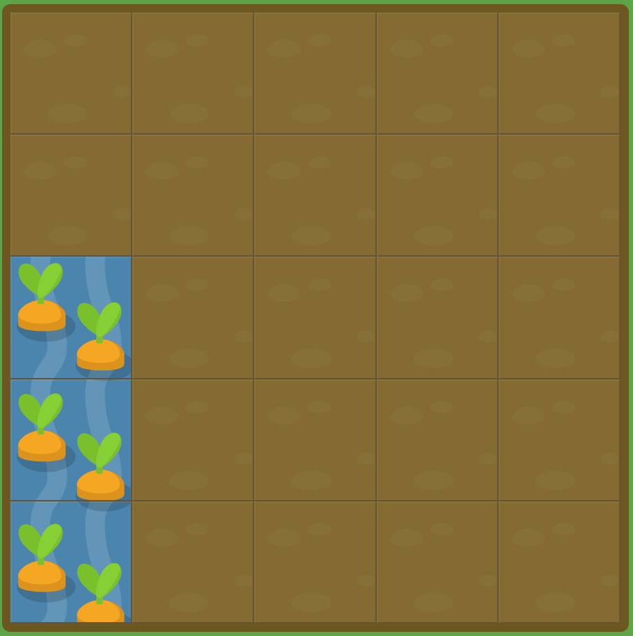

# GRID GARDEN LEVEL13

##### 이번에는 `grid-row` 속성을 이용하여 물을 주세요.

```
#garden {
  display: grid;
  grid-template-columns: 20% 20% 20% 20% 20%;
  grid-template-rows: 20% 20% 20% 20% 20%;
}

#water {
  grid-row : 3 / 6;
}
```



grid-row로 이전에 했던 grid-column과 같은 방식으로 해결하면 된다.