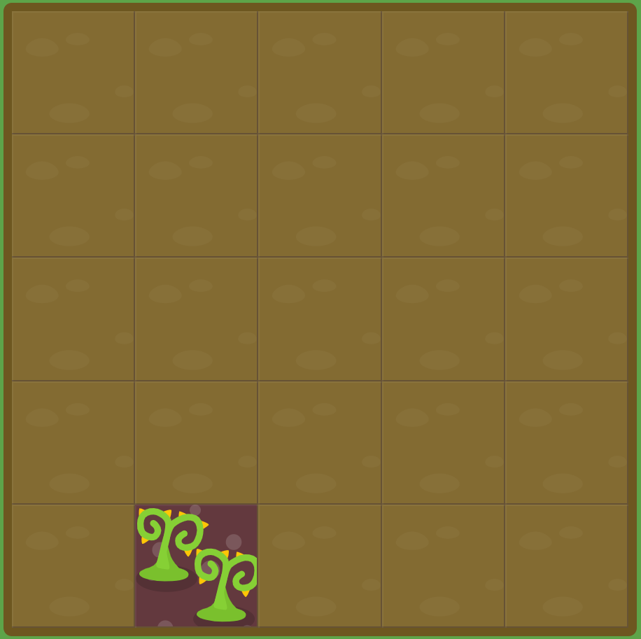

# GRID GARDEN LEVEL14

##### `grid-column`와 `grid-row`를 동시에 사용해서 위치를 지정해보세요.

```
#garden {
  display: grid;
  grid-template-columns: 20% 20% 20% 20% 20%;
  grid-template-rows: 20% 20% 20% 20% 20%;
}

#poison {
  grid-column : 2 / 3;
  grid-row : 5 / 6;
}
```



grid-column과 grid-row를 둘 다 사용해서 해결하면 된다.