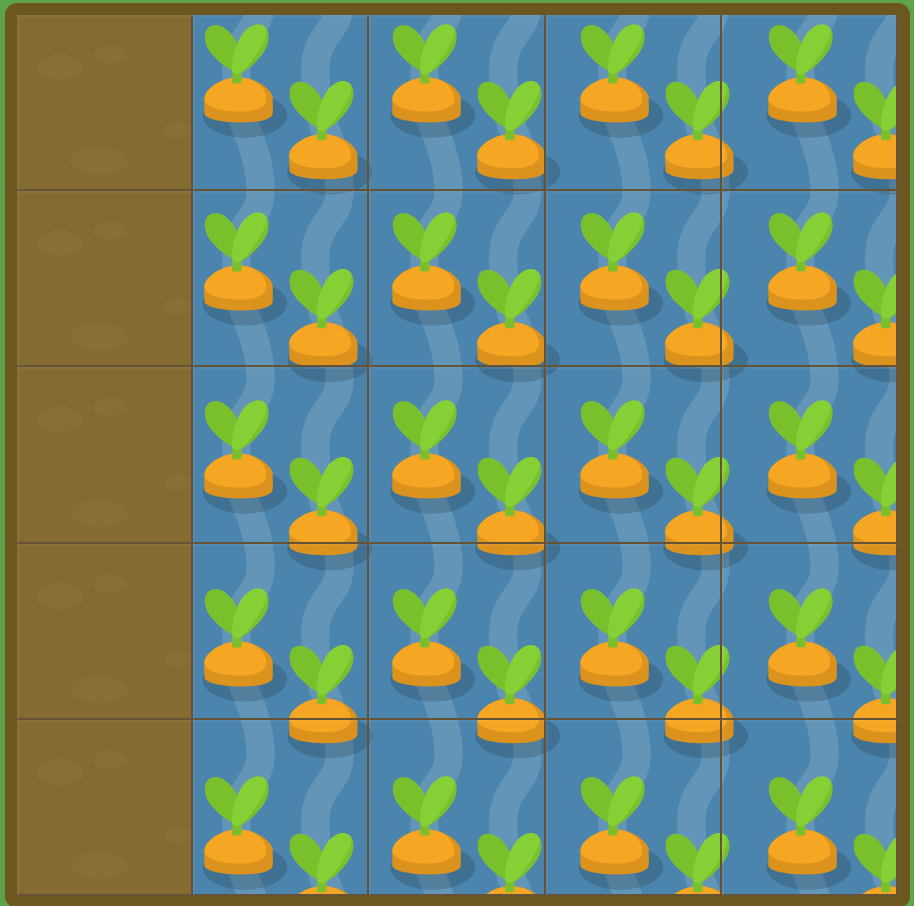

# GRID GARDEN LEVEL15

##### 또한 `grid-column`와 `grid-row`를 span과 함께 사용하여 넓은 영역을 지정할 수 있습니다. 한번 시도해보세요.!

```
#garden {
  display: grid;
  grid-template-columns: 20% 20% 20% 20% 20%;
  grid-template-rows: 20% 20% 20% 20% 20%;
}

#water {
  grid-column : 2 / 6;
  grid-row : 1 / 6;
}
```



grid-column과 grid-row를 둘 다 사용해서 해결하면 된다.

