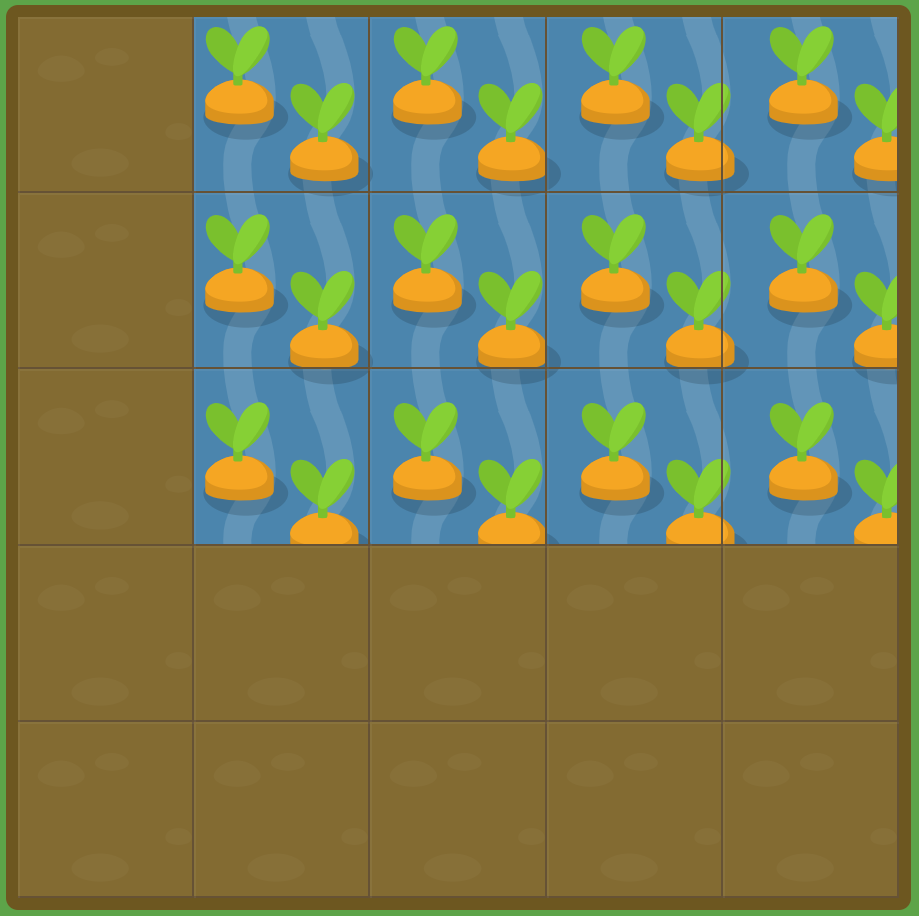

# GRID GARDEN LEVEL16

##### `grid-column`와 `grid-row` 모두를 입력하는게 너무 많은경우, 다른 속성을 이용하여 줄일 수 있습니다. `grid-area`은 /(슬래쉬)로 구분지어 `grid-row-start`, `grid-column-start`, `grid-row-end`, `grid-column-end`순으로 입력 가능합니다.

##### 한가지로 예로 다음과 같습니다. `grid-area: 1 / 1 / 3 / 6;`

```
#garden {
  display: grid;
  grid-template-columns: 20% 20% 20% 20% 20%;
  grid-template-rows: 20% 20% 20% 20% 20%;
}

#water {
  grid-area : 1/2/4/6;
}
```



grid-area를 통해서 grid-column, grid-row를 한 번에 처리가 가능하다.