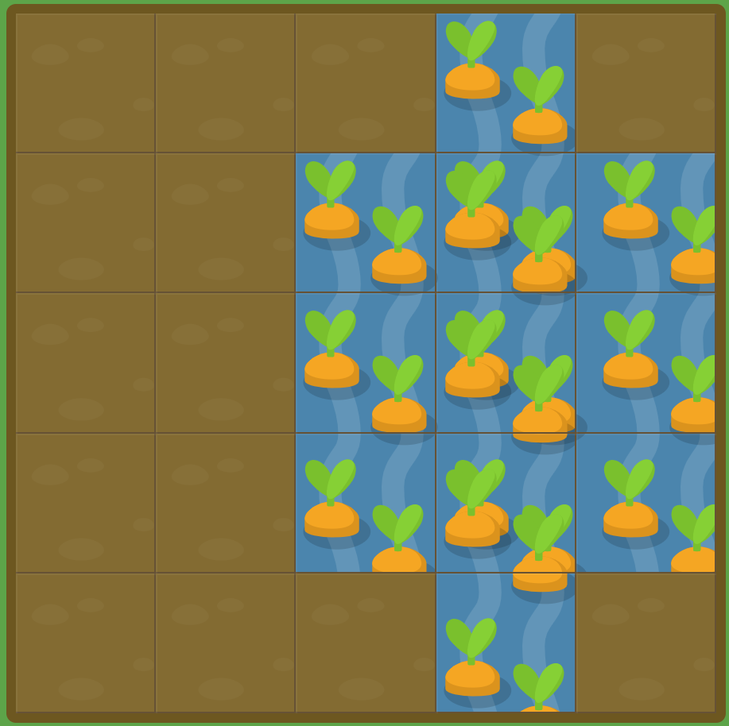

# GRID GARDEN LEVEL17

##### 여러 항목은 어떤가요? 아무문제 없이 겹치도록 설정이 가능합니다. `grid-area`를 사용하여 두번째 영역을 아직 물이 없는 당근영역에 포함시키세요.

```
#garden {
  display: grid;
  grid-template-columns: 20% 20% 20% 20% 20%;
  grid-template-rows: 20% 20% 20% 20% 20%;
}

#water-1 {
  grid-area: 1 / 4 / 6 / 5;
}

#water-2 {
  grid-area : 2 / 3 / 5 / 6;
}
```



grid-area를 통해서 grid-column, grid-row를 한 번에 처리가 가능하다.