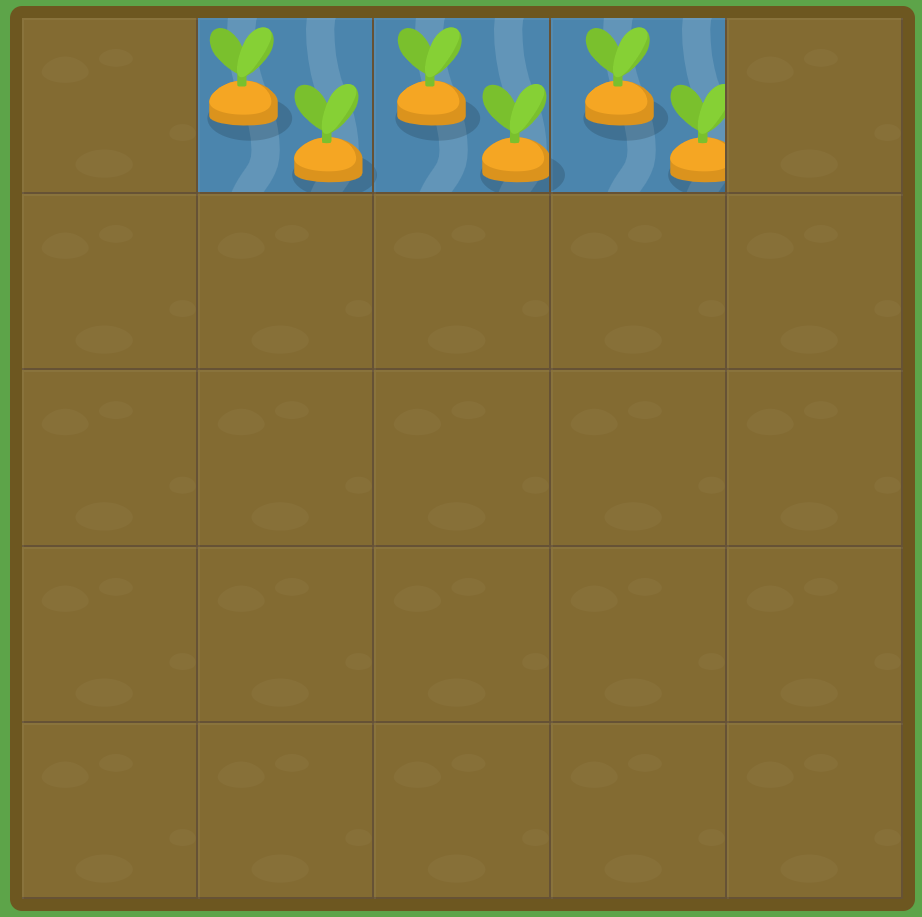

# GRID GARDEN LEVEL4

##### `grid-column-start` 와 `grid-column-end`를 같이 사용할때, 시작 값보다 마지막 값이 더 커야한다고 생각하실 수 있습니다. 하지만 꼭 그렇지만 않습니다!

##### `grid-column-end`를 5보다 낮은 값으로 설정하여 당근에 물을 주시기 바랍니다.

```css
#garden {
  display: grid;
  grid-template-columns: 20% 20% 20% 20% 20%;
  grid-template-rows: 20% 20% 20% 20% 20%;
}

#water {
  grid-column-start: 5;
grid-column-end : 2;
}
```



이 문제는 시작점과 끝점의 순서를 반대로 하여 5번 가로선부터 2번 가로선으로 하는 문제이다.