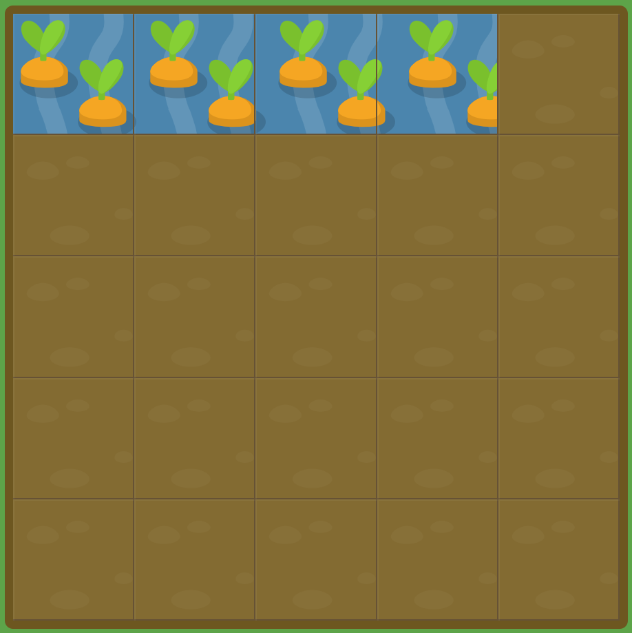

# GRID GARDEN LEVEL5

##### 그리드 왼쪽의 기준이 아닌 오른쪽으로 기준을 하고싶다면, `grid-column-start` 와 `grid-column-end`를 음수로 설정하시면 됩니다. 예를들어, -1로 오른쪽 첫뻔재 세로선을 지정하실 수 있습니다.

##### `grid-column-end`를 음수로 설정해보세요.

```css
#garden {
  display: grid;
  grid-template-columns: 20% 20% 20% 20% 20%;
  grid-template-rows: 20% 20% 20% 20% 20%;
}

#water {
  grid-column-start: 1;
  grid-column-end : -2
}
```



여태까지의 문제들과 같고, column-end의 값인 인덱스 설정을 음수로 했을 때의 결과를 구하는 문제이다.

시작점인 1부터 -2인 지점까지의 인덱스 값을 구하게 되면 해결할 수 있다.