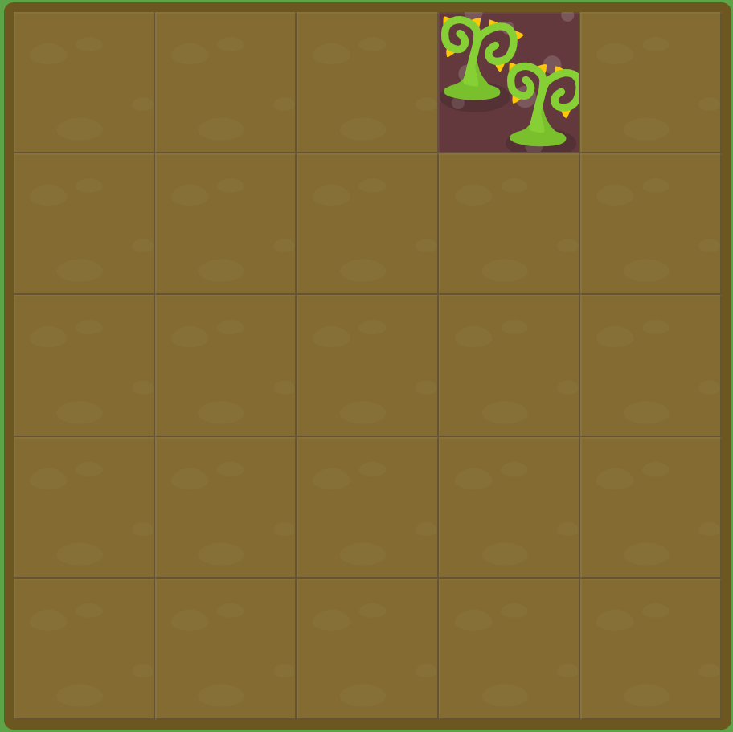

# GRID GARDEN LEVEL6

##### `grid-column-end`를 음수로 설정해보세요.

```css
#garden {
  display: grid;
  grid-template-columns: 20% 20% 20% 20% 20%;
  grid-template-rows: 20% 20% 20% 20% 20%;
}

#poison {
  grid-column-start : -3;
}
```



column-start를 음수로 지정해주면 해결할 수 있다.