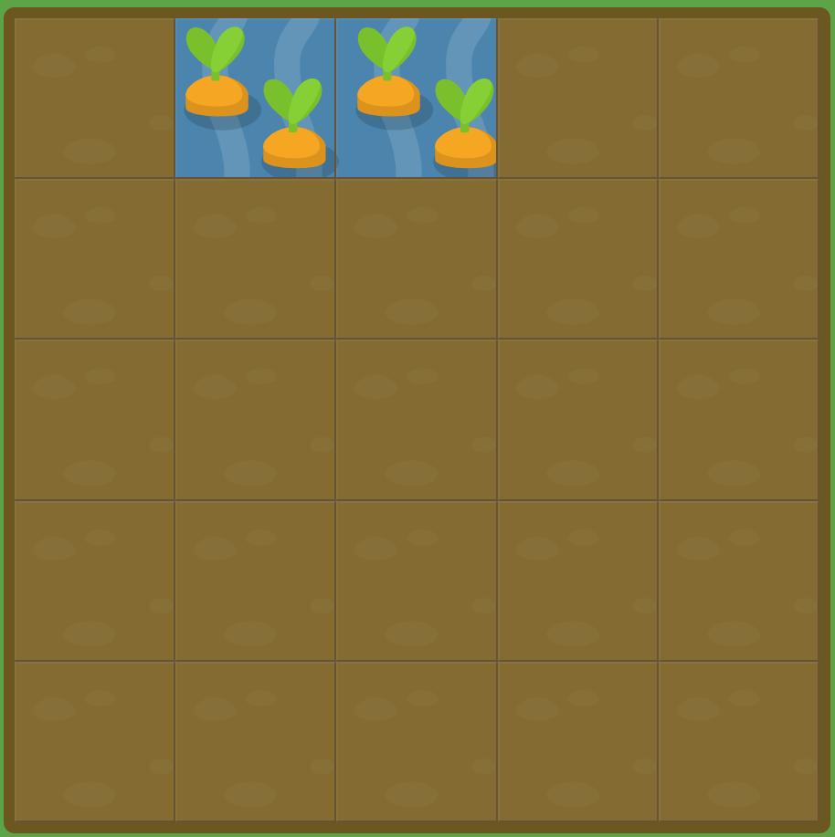

# GRID GARDEN LEVEL7

##### 그리드 선의 시작과 끝 위치를 기준으로 그리드 항목을 정의하는 대신, `span`을 이용하여 열(column)의 넓이를 지정할 수 있습니다. `span`은 양수만 설정 가능합니다.

##### 예를 들어, `grid-column-end: span 2;`와 같이 당근에 물을 주십시오.

```css
#garden {
  display: grid;
  grid-template-columns: 20% 20% 20% 20% 20%;
  grid-template-rows: 20% 20% 20% 20% 20%;
}

#water {
  grid-column-start: 2;
  grid-column-end : span 2;
}
```



여태까지 했던 가로선 대신 span을 통해서 몇 칸을 칠할지 설정할 수 있다.